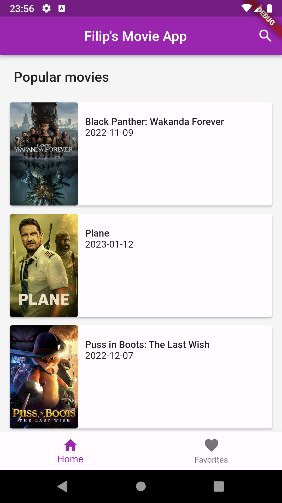
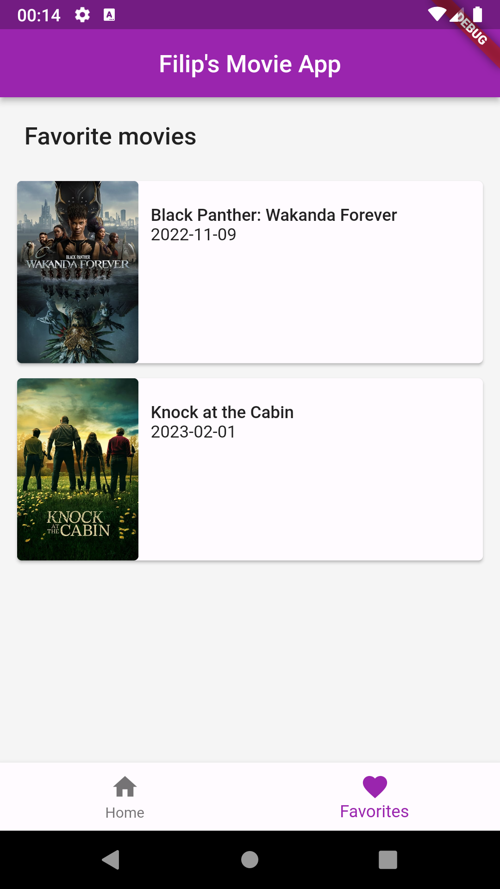
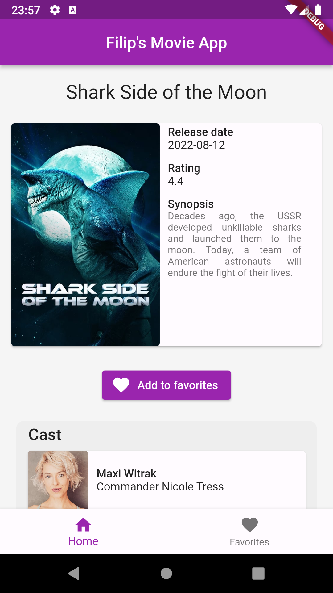
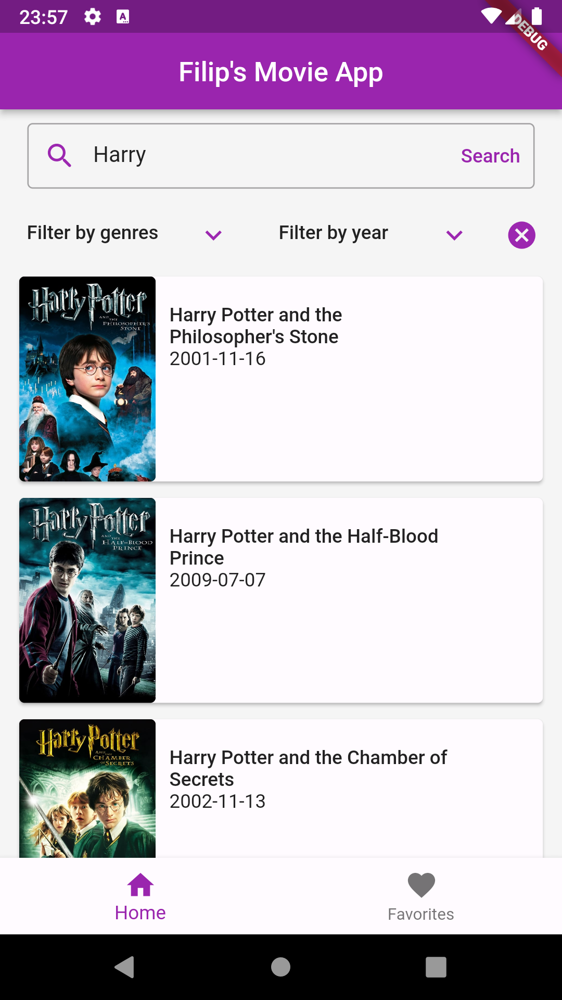
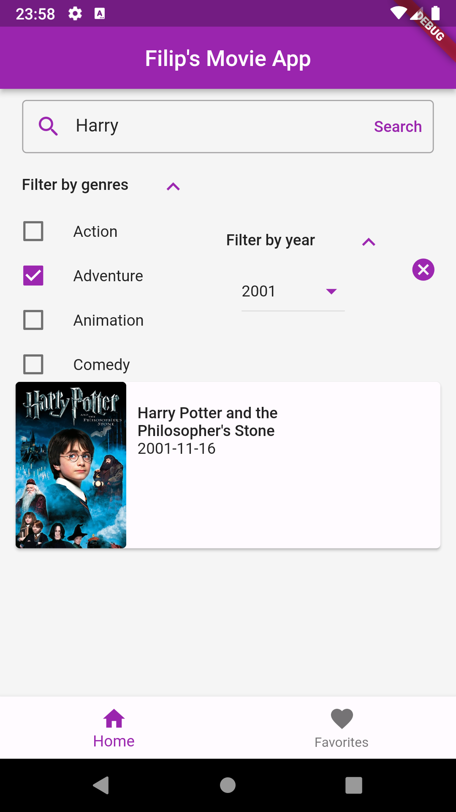

<h3>Movie app</h3>

State management - BLoC

API communication - Dio (www.themoviedb.org)

Functionalities implemented:
- Retrieve a list of popular movies and display them in a scrollable list
- Fetch more results when user srolls to the bottom of the page (infinite scrollable list)
- Movie details page with list of cast members
- Add or remove favorite movie and save favorite movies locally
- Display list of favorite movies on a separate page
- Search movies by title
- Filter search results via genres and/or release year
- Reset filter with reset button and display most recent search results

<h5>Screenshots</h5>

    
